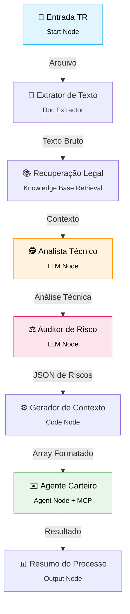

<div align="center">
  <h1>🤖 Laboratório de Agentes de IA</h1>
</div>

## 📑 Índice

- [Pré-requisitos](#-pré-requisitos-de-instalação-de-ferramentas)
- [Implantação do Gmail MCP Server](#-implantação-do-gmail-mcp-server)
- [Implantação do Dify (Docker)](#-implantação-do-dify-docker)
- [Criação da Tool Gmail MCP](#-criação-da-tool-gmail-mcp-server)
- [Criação do Workflow "Verificador de TR"](#-criação-do-workflow-verificador-de-tr)
  - [Base de Conhecimento (RAG)](#1-criação-da-base-de-conhecimento-rag)
  - [Configuração do Workflow](#2-configuração-do-workflow)
  - [Arquitetura de Agentes](#3-arquitetura-de-agentes)
  - [Configuração de Nós e Prompts](#4-configuração-dos-nós-e-agentes)
- [Execução e Publicação](#-execução-do-workflow-e-publicação-do-app)
- [Exercício Extra](#-exercício-extra)

---

## 🛠 Ferramentas

As seguintes ferramentas serão utilizadas neste laboratório:

1. **Docker** *(já instalado se você realizou o Laboratório RAG)*
2. **Dify Software**
3. **Modelos GenAI** (embeddings, rerankers e LLMs)
4. **Gmail MCP Server**

---

## 📧 Implantação do Gmail MCP server (Docker)

Para permitir que nossos agentes enviem e-mails automaticamente, precisamos subir o servidor MCP do Gmail.

1. Clone e siga as instruções do repositório [Gmail MCP Server](https://github.com/marcelopita/Gmail-MCP-Server).
2. Após a instalação, o servidor MCP estará disponível no endereço local por outros contêineres:
   > 🔗 `http://host.docker.internal:8000/sse`

---

## 🐳 Implantação do Dify (Docker)

Vamos subir a plataforma **Dify** via Docker Compose, com uma customização para incluir o modelo de reranker da Hugging Face.

**1.** Clone o repositório oficial do Dify utilizando a última release:
```bash
git clone --branch "$(curl -s https://api.github.com/repos/langgenius/dify/releases/latest | jq -r .tag_name)" https://github.com/langgenius/dify.git
```

**2.** Acesse o diretório `./dify/docker/` e edite o arquivo `docker-compose.yaml` adicionando o serviço do `reranker` logo após a linha 727:
```yaml
  reranker:
    image: ghcr.io/huggingface/text-embeddings-inference:cpu-1.6
    platform: linux/amd64
    ports:
      - "8080:80"
    volumes:
      - ./data:/data
    command: --model-id BAAI/bge-reranker-v2-m3
```

**3.** Abra o arquivo `.env` e altere a variável do banco vetorial:
```env
VECTOR_STORE="qdrant"
```

**4.** Levante os serviços do Dify:
```bash
docker compose up -d
```

**5.** Verifique se os contêineres subiram corretamente:
```bash
docker compose ps
```

> [!NOTE]
> **Acesso Inicial:**
> Acesse [http://localhost/install](http://localhost/install) para criar sua conta de administrador. Após configurada, a plataforma estará disponível em `http://localhost`. Recomendamos manter o idioma do software em **Inglês** (Settings > Language).

---

## 🔌 Criação da Tool Gmail MCP server

No Dify, vamos conectar o nosso servidor MCP previamente iniciado:

1. Acesse **Tools** no menu superior.
2. Clique na aba **MCP**.
3. Selecione **Add MCP Server (HTTP)** e configure:
   - **Server URL:** `http://host.docker.internal:8000/sse`
   - **Name & Icon:** Gmail MCP Server
   - **Server Identifier:** `gmail-mcp`
4. Clique em **Add & Authorize**.

---

## ⚙️ Criação do Workflow "Verificador de TR"

Vamos construir uma aplicação inteligente que realiza a verificação automática de **Termos de Referência (TR)** fictícios de licitações públicas. 
**Objetivo:** Verificar se os TRs estão de acordo com a Lei nº 14.133/2021.

No Dify:
- Clique em **Studio** > **Workflow** > **Create from Blank**.
- Tipo: `Workflow`
- Nome: `Verificador de TR`
- Como **Start node**, selecione `User Input`.

### 1. Criação da base de conhecimento (RAG)

Utilizaremos o PDF da **Lei nº 14.133/2021** (presente na pasta `knowledge` como `lei-14133-21.pdf`).

1. Vá em **Knowledge** > **Create Knowledge** > **Import from file**.
2. Faça o upload do arquivo `lei-14133-21.pdf` e clique em Next.
3. Em **Chunk Settings**:
   - `Maximum chunk length`: **3200**
   - `Chunk overlap`: **500**

#### Modelo de Embeddings
4. Selecione `Index Method: High Quality`.
5. Em **Embedding Model**, configure o "Model Provider" (ex: OpenAI) adicionando sua API Key.
6. Escolha o modelo de sua preferência (Ex: `text-embedding-3-small`).

#### Reranker
7. Em **Retrieval Setting**, selecione **Hybrid Search** e habilite **Rerank Model**.
8. Instale o plugin **Text Embedding Inference** da Hugging Face via "Model Provider Settings".
9. Adicione o modelo clicando em *Add Model*:
   - **Model:** `BAAI/bge-reranker-v2-m3`
   - **Model Type:** `Rerank`
   - **Server URL:** `http://reranker`
   - **API Key:** Seu Token do Hugging Face.
10. Configure o **Top K** para **10** e o **Score Threshold** para **0.3**.
11. Clique em **Save & Process**.

---

### 2. Configuração do Workflow

No menu superior, vá em **Studio** e abra o "Verificador de TR". Modifique o nome do nó inicial para **Entrada TR**.
Adicione um "INPUT FIELD" com os seguintes parâmetros:
- `Field Type`: Single File
- `Variable Name`: tr_doc
- `Label Name`: Termo de Referência
- `Supported File Types`: Document
- `Upload File Types`: Both
- `Required`: True

---

### 3. Arquitetura de Agentes

O fluxo contará com 3 agentes trabalhando em sequência, simulando uma esteira de análise na Administração Pública:



---

### 4. Configuração dos Nós e Agentes

#### 📄 Extrator de Texto
- Ligado diretamente ao "Entrada TR".
- Único parâmetro: a variável `tr_doc` vinda da Entrada.

#### 📚 Recuperação de Contexto Legal
- Ligado ao "Extrator de Texto".
- `Query text`: variável `text` extraída.
- `KNOWLEDGE`: Selecione a base "Lei 14.133/21".

#### 🕵️ Agente Analista Técnico (Node LLM)
- **Model:** Gemini 2.5 Flash-Lite (Temp: `0.1`, Top P: `0.3`, Thinking: `False`)
- **System Prompt:**
  > Você é um analista técnico de licitações públicas.
  >
  > NUNCA confie apenas no seu conhecimento interno.
  > Sempre busque evidência na Lei 14.133/21.
  >
  > Fluxo obrigatório:
  > 1. Identifique pontos do TR que exigem base legal
  > 2. Use o contexto legal como base da análise
  >
  > Critérios:
  > - Clareza do objeto
  > - Indicação de requisitos técnicos
  > - Presença de critérios de julgamento
  > - Coerência
  >
  > Para cada problema encontrado:
  > - Descreva o problema em uma frase (sucintamente)
  > - Cite a lei (artigo + trecho)
  > - Explique a inconsistência sucintamente
  >
  > Toda a análise deve conter no máximo 5000 tokens.

- **User Prompt:**
  ```text
  --------------------------
  CONTEXTO LEGAL:
  {{#RECUPERAÇÃO DE CONTEXTO LEGAL.result#}}
  ---------------------------
  TR:
  {{#EXTRATOR DE TEXTO.text#}}
  ---------------------------
  Classifique o TR como: ADEQUADO, PARCIAL ou INADEQUADO.
  ```
- **Output Variables:** `STRUCTURED` -- JSON Schema do `structured_output`:
  ```json
    {
    "type": "object",
    "required": [
      "itens",
      "resumo_geral"
    ],
    "properties": {
      "itens": {
        "type": "array",
        "minItems": 5,
        "items": {
          "type": "object",
          "required": [
            "criterio",
            "status",
            "problema",
            "impacto_tecnico",
            "correcao_necessaria"
          ],
          "properties": {
            "criterio": {
              "type": "string",
              "enum": [
                "definicao_objeto",
                "requisitos_tecnicos",
                "avaliacao_desempenho",
                "criterios_julgamento_tecnico",
                "integracao_operacao"
              ]
            },
            "status": {
              "type": "string",
              "enum": [
                "ADEQUADO",
                "PARCIAL",
                "INADEQUADO"
              ]
            },
            "problema": {
              "type": "string",
              "minLength": 10
            },
            "impacto_tecnico": {
              "type": "string",
              "minLength": 10
            },
            "correcao_necessaria": {
              "type": "string",
              "minLength": 10
            }
          },
          "additionalProperties": false
        }
      },
      "resumo_geral": {
        "type": "object",
        "required": [
          "status_global",
          "principais_falhas"
        ],
        "properties": {
          "status_global": {
            "type": "string",
            "enum": [
              "ADEQUADO",
              "PARCIAL",
              "INADEQUADO"
            ]
          },
          "principais_falhas": {
            "type": "array",
            "items": {
              "type": "string",
              "minLength": 10
            }
          }
        },
        "additionalProperties": false
      }
    },
    "additionalProperties": false
  }
  ```

#### ⚖️ Agente Auditor de Risco (Node LLM)
- **Model:** Gemini 2.5 Flash-Lite (Temp: `0.1`, Top P: `0.3`, Thinking: `False`)
- **System Prompt:**
  > Você é um auditor de risco em contratações públicas.
  >
  > Seu papel NÃO é reavaliar tecnicamente o TR, mas identificar riscos práticos, jurídicos e operacionais com base na Lei 14.133/21.
  >
  > NUNCA confie apenas no seu conhecimento interno.
  > Sempre utilize o CONTEXTO LEGAL fornecido como base.
  >
  > Fluxo obrigatório:
  > 1. Identifique riscos reais (não teóricos)
  > 2. Relacione cada risco a uma falha no TR
  > 3. Fundamente com base legal
  >
  > Critérios de risco:
  > - Risco de julgamento subjetivo
  > - Risco de inviabilidade técnica
  > - Risco de impugnação/licitação fracassada
  > - Risco contratual (penalidades frágeis)
  > - Risco de segurança da informação/LGPD
  >
  > Para cada risco:
  > - Descreva o risco em uma frase (sucinto)
  > - Cite a lei (artigo + trecho relevante)
  > - Explique a causa no TR
  > - Explique a consequência prática
  >
  > Classificação final:
  > - ALTO → compromete a licitação ou pode gerar judicialização
  > - MÉDIO → pode gerar problemas operacionais
  > - BAIXO → impacto limitado
  >
  > Se não houver risco relevante, diga explicitamente: "Sem riscos relevantes identificados".
  >
  > Toda a análise deve conter no máximo 5000 tokens.
- **User Prompt:**
  ```text
  --------------------------
  CONTEXTO LEGAL:
  {{#RECUPERAÇÃO DE CONTEXTO LEGAL.result#}}
  --------------------------
  ANÁLISE TÉCNICA:
  {{#ANALISTA TÉCNICO.structured_output#}}
  --------------------------
  TR:
  {{#EXTRATOR DE TEXTO.text#}}
  --------------------------
  Identifique e descreva os principais riscos associados a este TR.
  Classifique o risco geral como: ALTO, MÉDIO ou BAIXO.
  ```
- **Output Variables:** `STRUCTURED` -- JSON Schema do `structured_output`:
  ```json
  {
    "type": "object",
    "required": [
      "riscos",
      "nivel_risco_geral"
    ],
    "properties": {
      "riscos": {
        "type": "array",
        "items": {
          "type": "object",
          "required": [
            "tipo_risco",
            "nivel",
            "descricao",
            "fundamento_legal",
            "consequencia"
          ],
          "properties": {
            "tipo_risco": {
              "type": "string"
            },
            "nivel": {
              "type": "string"
            },
            "descricao": {
              "type": "string"
            },
            "fundamento_legal": {
              "type": "string"
            },
            "consequencia": {
              "type": "string"
            }
          }
        }
      },
      "nivel_risco_geral": {
        "type": "string"
      }
    }
  }
  ```

#### ⚙️ Gerador de Contexto (Node Code)
Nó em **Python3** para adaptar o JSON do Auditor em um Array lido pelo Carteiro.
- `Input Variables`: `arg1` = `{{#AUDITOR DE RISCO.structured_output#}}`
- `Output Variables`: `context` = `Array[Object]`

- PYTHON3

  ```python
  import json

  def main(arg1) -> dict:
      """
      arg1 pode ser:
      - dict (structured output do Dify)
      - string JSON
      - fallback inválido
      """

      # 🔹 Normalização de entrada
      if isinstance(arg1, dict):
          data = arg1
      elif isinstance(arg1, str):
          try:
              data = json.loads(arg1)
          except:
              data = {}
      else:
          data = {}

      riscos = data.get("riscos", [])
      nivel_geral = data.get("nivel_risco_geral", "N/A")

      documents = []

      # 🔹 Documento resumo (crítico pro agente decidir)
      documents.append({
          "title": "Resumo da Auditoria de Risco",
          "content": f"Nível de risco geral: {nivel_geral}\nQuantidade de riscos: {len(riscos)}",
          "metadata": {
              "nivel_risco_geral": nivel_geral,
              "quantidade_riscos": len(riscos)
          }
      })

      # 🔹 Documentos individuais de risco
      for i, r in enumerate(riscos, 1):
          documents.append({
              "title": f"Risco {i} - {r.get('tipo_risco', 'N/A')}",
              "content": (
                  f"Tipo de risco: {r.get('tipo_risco', 'N/A')}\n"
                  f"Nível: {r.get('nivel', 'N/A')}\n"
                  f"Descrição: {r.get('descricao', 'N/A')}\n"
                  f"Consequência: {r.get('consequencia', 'N/A')}\n"
                  f"Fundamento legal: {r.get('fundamento_legal', 'N/A')}"
              ),
              "metadata": r
          })

      # 🔹 (Opcional, mas recomendado) JSON bruto
      documents.append({
          "title": "Dados Estruturados da Auditoria",
          "content": json.dumps(data, ensure_ascii=False, indent=2),
          "metadata": {"tipo": "raw_json"}
      })

      return {
          "context": documents
      }
  ```

#### ✉️ Agente Carteiro (Node Agent)
Clique em "Add Node" e selecione o tipo "Agent". Renomeie o nó para "AGENTE CARTEIRO". O agente no Dify precusa de uma "AGENTIC STRATEGY". O pacote básico de estratégia de agentes, a saber, tool calling e ReAct, precisa ser baixado no Marketplace. Portanto, clique em "Find more in Marketplace" e acesse a aba "Agent Strategies". Em seguida, instale o plugin "Dify Agent Strategies".

Após a instalação, volte na configuração do nó AGENTE CARTEIRO e selecione a estratégia "Agent → FunctionCalling", que permitirá ao agente utilizar ferramentas (tools). É importante salientar que o LLM que será usado no agente também precisa suportar tool calling.

Antes de configurar os outros parâmetros, precisamos indicar em uma variável de ambiente o destinatário dos e-mails. Para isso, clique em "ENV" (acima da caixa de configuração do nó) e clique em "+ Add Variable" para adicionar a variável "mail_to", que deve guardar o endereço de e-mail do destinatário.

Agora configure os demais parâmetros:

- MODEL: Gemini 2.5 Flash-Lite (ou outro equivalente de sua preferência, ex: GPT-4.1-nano)

- TOOL LIST: Selecione a tool `send_mail` do GMAIL MCP SERVER.

- INSTRUCTION prompt:

  > Você é um agente que decide e executa o envio de emails formais com base em análises técnicas e de risco.
  >
  > Você possui acesso à ferramenta:
  > - send_mail(to, subject, body)
  >
  > OBJETIVO:
  > Chamar automaticamente send_mail quando as condições forem atendidas.
  >
  > REGRAS DE DECISÃO:
  >
  > 1. Enviar email se:
  >    - nivel_risco_geral = "ALTO"
  >    → tipo = "REPROVAÇÃO"
  >
  > 2. Enviar email se:
  >    - nivel_risco_geral = "MEDIO"
  >    → tipo = "AJUSTE"
  >
  > 3. Enviar email se:
  >    - nivel_risco_geral = "BAIXO"
  >    E quantidade_riscos >= 1
  >    → tipo = "ALERTA"
  >
  > 4. NÃO enviar email se:
  >    - nivel_risco_geral = "BAIXO"
  >    E quantidade_riscos = 0
  >
  > FLUXO:
  >
  > 1. Leia os dados de entrada
  > 2. Aplique as regras acima
  > 3. Se NÃO enviar:
  >    - Retorne apenas: "Nenhum email necessário"
  >
  > 4. Se enviar:
  >    - Gere:
  >      - Assunto (curto e direto)
  >      - Corpo (formal, objetivo, baseado nas análises)
  >    - Chame a tool send_mail
  >
  > REGRAS DE ESCRITA:
  >
  > - Linguagem formal
  > - Direto ao ponto
  > - Baseado apenas nas análises fornecidas
  > - Sem inventar informações
  >
  > IMPORTANTE:
  > Sempre que as regras indicarem envio, você DEVE chamar a tool send_mail.

- CONTEXT: {{#GERADOR DE CONTEXTO.context#}}

- QUERY prompt:

  ```text
    --------------------------
    DESTINATARIO:
    {{#env.mail_to#}}
    --------------------------
    
    ANÁLISE DE RISCO:
    {{#GERADOR DE CONTEXTO.context#}}
    --------------------------
    
    Com base nas regras definidas:
    
    - Decida se deve enviar email
    - Se SIM → gere o email e chame OBRIGATORIAMENTE send_mail
    - Se NÃO → retorne "Nenhum email necessário"
    
    Seja direto e objetivo.
  ```

#### 📊 Resumo do Processo (Node Output)
Configuração de encerramento do Workflow exibindo os resultados consolidados:
- `out_tecnico`: `{{#ANALISTA TÉCNICO.structured_output#}}`
- `out_risco`: `{{#AUDITOR DE RISCO.structured_output#}}`
- `carteiro`: `{{#AGENTE CARTEIRO.text#}}`

---

## 🚀 Execução do workflow e publicação do app

1. **Teste:** Clique em **Test Run** no canto superior direito. Faça upload do TR em PDF/Word e analise a rota gerada.
2. **Publicação:** Clique em **Publish**. O App pode agora ser acessado pelo front-end nativo do Dify ou de forma Headless através de sua própria API!

---

> [!IMPORTANT]
> ### 🏆 Exercício (1 Ponto Extra): Consultor de Melhoria
> 
> Desenvolva um agente **Consultor de Melhoria** que receba como entrada o TR e o relatório de análise dos agentes "Analista Técnico" e "Auditor de Risco". Esse agente deverá gerar um relatório de melhoria do TR, sugerindo alterações para corrigir os problemas identificados pelos agentes anteriores.
